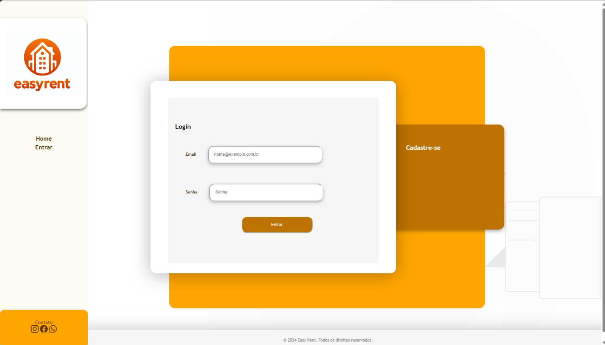

# Projeto de Interface

Pré-requisitos: <a href="02-Especificação do Projeto.md"> Documentação de Especificação</a>

## Diagrama de Fluxo

O diagrama apresenta o estudo do fluxo de interação do usuário com o sistema interativo e  muitas vezes sem a necessidade do desenho do design das telas da interface. 

## Wireframes

#### Home (Página Inicial)

#### Login

#### Home (Usuário logado)

#### Imóveis

#### Cadastro de Imóveis

